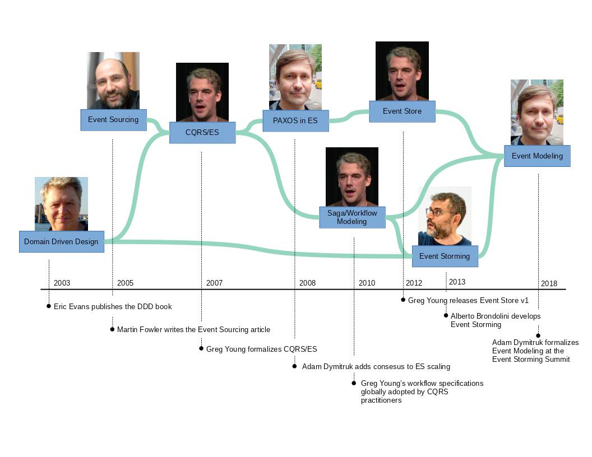

Ile razy słyszałeś(-aś) takie, czy inne zdanie:
- Niestety... niedoszacowaliśmy tego zadania. Skończę to jutro. Co? Mówiłem tak wczoraj?!
- Nie mogę zacząć tego zadania, bo blokuje mnie XYZ.
- Nie jest nigdzie zaprojektowane, co ja mam zrobić.
- Ten projekt trzeba cały przepisać, bo to już legacy — po miesiącu od startu.
- Event Sourcing? Przecież to bardzo trudne, lepiej zacznę od rozrysowania sobie modelu bazy danych.
- Jak to chciałbyś wiedzieć, jak często ludzie rezygnują z zakupionego pakietu? Nie zapisywaliśmy tego w bazie danych...
- Ty mówisz na niego „Candidate", ale w kodzie mamy napisane „User".
- Rzeczywiście, może się to przyda, ale przecież zasada YAGNI. Usuńmy to.
- Tej klasy nie da się już podzielić. Przecież „Produkt” ma relacje do wszystkiego w naszym systemie.
- Gdybyśmy robili projekt przed implementacją, to nie jesteśmy zwinni.
- Fajnie, że dołączyłeś do naszego zespołu! Teraz czas na miesiąc wgłębiania się w kod, abyś mógł cokolwiek napisać.

Mogło to nie raz dolecieć do Twoich uszu albo wydobyć się nawet z Twoich ust.
Obiecałeś sobie, że w nowym projekcie będzie inaczej? A potem niestety znowu to samo...
Zobacz, jak zostać realnym partnerem dla biznesu dzięki metodzie EventStorming, a później zaprojektuj system w myśl „small design up front” stosując Event Modeling.
Zainteresowany? Zapraszam niżej po szczegóły!

# Szkolenie praktyczne: EventStorming & Event Modeling

**Czas trwania:** około 8-12 godzin (np. 2-3 dni po 4 godziny)

**Gdzie?** zdalnie (Google Meet/Zoom + Discord/Slack + Miro/Figma)

**Maksymalna liczba uczestników**: 8

**Dla kogo?**
Najwięcej ze szkolenia skorzystają Architekci Oprogramowania i Programiści, ale Product Owner czy Analityk Biznesowy też znajdzie coś dla siebie.
Szkolenie nie wymaga znajomości EventStormingu czy Event Modelingu ani żadnego konkretnego języka programowania.
Pojawią się przykłady kodu, które powinny być zrozumiałe dla większości osób, które miały styczność z kodowaniem.

## Tematyka szkolenia 🤔

W trakcie szkolenia poznasz następujące zagadnienia i zastosujesz je w praktyce:
- Zobaczysz, co to Bounded Context i jak stosować zasady SOLID na poziomie architektury;
- Odkryjesz działanie omawianej domeny za pomocą EventStormingu;
- Wykonasz design systemu z użyciem Event Modelingu (na jakiej zasadzie wyznaczać mikroserwisy czy dzielić modularny monolit);
- Zobaczysz, jak te praktyki pomagają zaplanować pracę i podzielić zadania, a także wycenić implementację;
- Zaplanujesz rozszerzalną architekturę systemu i zobaczysz zależności między komponentami;
- Otrzymasz materiały do dalszego własnego rozwoju poznanych umiejętności.

Płynnie będziemy poruszać się w takich obszarach jak:
EventStorming, Event Modeling, Domain-Driven Design, Event Sourcing, CQRS, Bounded Context, Modularny Monolit, Mikroserwisy.
Głównie skupimy się oczywiście na dwóch pierwszych wymienionych, a reszta jest naturalną konsekwencją.

### Event Modeling 🔸
Wisienką na torcie naszego szkolenia, po przejściu przez fazę BigPicture EventStorming będzie przejście do Event Modelingu.
Jest to alternatywa dla faz Process i Design Level.
Event Modeling wykorzystuje naturalne umiejętności człowieka do opowiadania historii.
Poczujemy się jak reżyser dobrego filmu, ale scenariuszem będzie przepływ Eventów w naszej aplikacji.
Następnie podzielimy system na niezależne części (tzw. slice), gdzie główne role mogą odgrywać developerzy niezależnie, nie blokując swojej pracy.
Dodatkowo od razu otrzymujesz gotowe przypadki testowe!

Warto, żebyś przed szkoleniem zapoznał się z wprowadzeniem do Event Modelingu od samego autora tej metody.
- [Event Modeling: What is it? | Adam Dymitruk](https://eventmodeling.org/posts/what-is-event-modeling/)

Jeśli już nie możesz się doczekać, to więcej tematów znajdziesz na mojej liście [Awesome EventModeling.](https://github.com/MateuszNaKodach/awesome-eventmodeling)

Nie musisz wszystkiego od razu zrozumieć, bo jak wiadomo: „mimo że w teorii nie ma różnicy między teorią a praktyką, to w praktyce jest".
My w trakcie szkolenia skupimy się maksymalnie na praktyce, przez którą też przyjdzie zrozumienie.
Przejdziemy od przyklejania kolorowych karteczek na ścianie (albo przesuwania na ekranie monitora) do gotowego projektu funkcjonalności systemu, gdzie nawet Junior będzie mógł być efektywnym członkiem zespołu.
Jak wygląda taki projekt systemu, możesz zobaczyć na przykładzie z kursu, który prowadziłem:
- [Table Soccer Tournaments system (EventStorming + Event Modeling)](https://miro.com/app/board/o9J_lOEebqI=/?moveToWidget=3074457356075616433&cot=14)

Poniżej możesz zobaczyć jeszcze oś czasu ze strony EventModeling.org pokazującą jak Event Modeling czerpał i wyewoluował z podejść takich jak
Domain-Driven Design czy EventStorming.

## Metoda szkoleniowa ⚙️

Uczestnicy szkolenia w naturalny sposób, najpierw wykonują czynności i popełniają też błędy — co jest normalną częścią procesu uczenia się.
Następnie wyciągamy wnioski z wykonanych ćwiczeń-wszystko przy angażującym wsparciu prowadzącego.
Razem analizujemy napotkane trudności i polepszamy swoje rozumienie tematu.
Działa to podobnie do dziecka poznającego świat, które jest prowadzone przez rodzica.
Część „wykładowa” jest ograniczona do niezbędnego minimum.
Po każdym z etapów wspólnie zastanowimy się, jak wykorzystać nabyte umiejętności w Twoim projekcie.

## Program szkolenia 🎓

Program jest ramą, w jakiej możemy się poruszać merytorycznie.
Dokładna agenda, jak i liczba godzin dla każdego szkolenia dedykowanego jest ustalana na podstawie naszej rozmowy i ankiety dla uczestników.
Będziemy głębiej eksplorować aspekty, które są dla uczestników najbardziej interesujące.

### Przykładowa Agenda 📆

#### **Dzień I: EventStorming**
1. Ice Breaker - zapoznanie uczestników, omówienie oczekiwań
2. Ćwiczenie I: Zgubiony pantofelek
    1. Praca z tablicą wirtualną (MIRO/FigJam)
    2. Angażujący i humorystyczny wstęp do EventStormingu
       „Zdarzenia domenowe” - co to jest, jak je odkrywamy i zapisujemy
    4. Omówienie najczęściej występujących problemów
    5. Odkrywanie różnych perspektyw - Bounded Context, obsesja rzeczowników
    6. Upływ czasu jako istotny czynnik procesów biznesowych i analityki
3. Ćwiczenie II: Nie samym chlebem żyje projekt
    1. Zagrożenia: znajdowanie HotSpotów
    2. Wartości: odkrywanie zysków i strat. Gdzie są pieniądze?
    3. Ciekawostka: „EventStorming na co dzień” - gdzie przyda się w Twoim życiu na kodach?
4. Podsumowanie dotychczasowych ćwiczeń, wspólne wyciąganie wniosków.
5. Ćwiczenie III: EventStorming. Domena: GitHub
    1. Dodatkowa praktyka na realnym przykładzie
    2. Odróżnianie Komend i Widoków od Zdarzeń
    3. Różne rozumienie zdarzeń (4 poziomy)
    4. EventStorming zdalnie czy na żywo
6. Podsumowanie, wyciągnęcie wniosków, zapowiedź kolejnego dnia

#### **Dzień II: Event Modeling cz. I**
1. Ćwiczenie IV: Event Modeling. Domena: GitHub - Write & Read Slices
    1. Różnica między EventStorming a Event Modeling
    2. Jak przejść z EventStormingu do Event Modelingu
    3. Wyznaczanie SLICE - jak podzielić system na niezależne części. Dlaczego to takie ważne?
    4. Warstwy modelu, współbieżność, spójność natychmiastowa i ostateczna
    5. Wyznaczanie Agregatów i Event Streamów
2. Ćwiczenie V: Event Modeling. Domena: GitHub - Automation Slices
    1. YAGNI vs Open-Closed Principle
    2. Context Mapping i komunikacja
    3. Polityki - A co z ChatGPT? Przecież musimy gdzieś użyć AI
    4. Google to tylko jeden guzik i dwa ekrany? Granularność zdarzeń

#### **Dzień III: Event Modeling cz. II**
1. Ćwiczenie VI: Event Modeling & Persystencja
    1. Sneak Peek: Jak Event Modeling przekłada się na kod?
    2. Event Modeling + Event Sourcing = <3
    3. Event Modeling + zapisywanie aktualnego stanu
2. Ćwiczenie VII: Event Modeling i Project Management
    1. Podział pracy i estymacje
    2. Example Mapping, w myśl zasady Given-When-Then i przypadki testowe
    3. Event Modeling vs User Story
3. Podsumowanie ćwiczeń i omówienie gdzie Event Modeling Ci nie pomoże
4. Zakończenie szkolenia, przemyślenia uczestników i opinie

Wszystkie ćwiczenia realizowane są przez uczestników podzielonych na grupy.
Grupy są dobierane poziomem zaawansowania, tak aby każdy z uczestników wyciągną ze szkolenia jak najwięcej.

## Dlaczego ja? 👨‍💻
To nie tylko tytuł kiedyś popularnego serialu w TV, ale po prostu pytanie,
które na pewno sobie zadajesz, jeśli chcesz wybrać szkoleniowca dla swojego zespołu.

Szkolenie z podstaw EventStormingu znajdziesz w ofertach wielu firm. Ja Ci proponuję pójść o krok dalej.
Niestety z doświadczenia widzę, że zespoły bardzo zaangażowane w samo przyklejanie karteczek później nie wiedzą, jak przejść z tego do projektu systemu.
Deweloperzy i tak zaczynają od bazy danych, a projekty kończą jak rozproszony monolit.
Dlatego proponuję Ci właśnie EventStorming w połączeniu z Event Modelingiem, gdzie zaadresujemy te problemy i inne, które wymieniłem na samej górze tego dokumentu.

Tę metodę wykorzystałem z powodzeniem w wielu projektach komercyjnych,
co przełożyło się na bardziej przemyślany projekt i sprawniejsze dowożenie funkcjonalności.
Szkolenie jest mixem moich własnych doświadczeń i wiedzy, którą zbudowałem na bardzo solidnych fundamentach, czerpiąc od najlepszych w tej dziedzinie.

Event Modeling zgłębiałem od samego autora metody Adam Dymitruka.
Brałem udział w intensywnym szkoleniu, które prowadził on, a także Greg Young — światowej klasy specjalista od Event Sourcingu.
EventStorming poznawałem na spotkaniach grupy DDD Wrocław z pomocą m.in. Mariusza Gila-naszego Polskiego guru tej metody.

Jeśli chcesz mnie lepiej poznać, to zapraszam na mojego bloga [ZycieNaKodach.pl](https://zycienakodach.pl/o-mnie).

### Rekomendacje 💬

> Mateusz wprowadził EventStorming w projekty programistyczne w CodersCrew, chętnie organizował warsztaty na ten temat, dzięki czemu pomógł odkryć nową perspektywę na tworzenie aplikacji i tym samym wprowadzić innowację w stowarzyszeniu.
>
> ~ Katsiaryna Charnavus, prezes stowarzyszenia CodersCrew

> Ogromne doświadczenie programistyczne Mateusza było dla mnie bezcennym źródłem wiedzy. Oprócz stricte językowych zagadnień, Mateusz wprowadził mnie w świat architektury oprogramowania (Hexagonal), wzorców projektowych i innych bardziej złożonych zagadnień (Domain-Driven Design, Test Driven Development, Event Modeling, EventStorming).
> [...]
> Mateusz nie jest zwolennikiem chodzenia na skróty, dlatego nigdy nie podawał gotowych rozwiązań na tacy. Zamiast tego dawał wskazówki lub umiejętnie zadawał pytania, które pomagały nam dojść do rozwiązania na własną rękę.
>
> ~ Tomasz Dworniczak, Node.js Developer - mentorowany

> Mateusz w czasie pracy jest prawdziwym ekspertem od Domain-Driven Design i, jak sam przyznaje, zrewolucjonizowało to jego podejście do programowania. Jednocześnie nie buja w obłokach rozważając teoretyczne kwestie - jest też bardzo dobrym rzemieślnikiem i umie wykorzystać swoją wiedzę w praktyce. Kod, który wychodzi spod jego rąk jest najwyższej jakości.
>
> ~ Łukasz Dutka, Java Developer - współpracownik

---
[Więcej na LinkedIn](https://www.linkedin.com/in/mateusznakodach/details/recommendations/)

## Kiedy to szkolenie NIE jest dla Ciebie? ❌

Bardzo szanuję Twój i mój czas, dlatego zastanówmy się, czy na pewno wyniesiesz coś dla siebie z tych warsztatów.
EventStorming i Event Modeling to metody do odkrywania i projektowania procesów biznesowych.
Dlatego raczej Ci się nie przydadzą, jeśli Twoja praca to tylko:
- projektowanie skomplikowanych algorytmów;
- animacje, niestandardowy UI, modelowanie 3D;
- projektowanie AI czy Machine Learning.

Jeśli nie jesteś pewien, czy to dla Ciebie, to i tak spotkajmy się na niezobowiązującą rozmowę.
Jednak SZCZEGÓLNIE powinieneś wziąć udział w tym szkoleniu (i bez wymówek), jeśli stosujesz u siebie Event Sourcing 😊

## Jak zamówić szkolenie? 📩
Napisz do mnie maila na adres `mateusz@nakodach.pl` z tematem: `[Szkolenie] EventStorming & Event Modeling`.
Dodaj kilka zdań od siebie, dlaczego interesuje Cię to szkolenie. Odpiszę i umówimy się na spotkanie, aby ustalić szczegóły.

---

Jeśli jeszcze się wahasz, to namiastkę tego, co będziemy robić, możesz zobaczyć na moim blogu:
[ZycieNaKodach.pl: Event Modeling & Modularny Monolit | Od kolorowych karteczek do kodu poprzez TDD](https://zycienakodach.pl/event-modeling-modularny-monolit)

W trakcie TEGO konkretnego szkolenia nie będziemy implementować funkcjonalności w kodzie.
Jeśli będziesz chciał kontynuować współpracę i zamówić kolejne warsztaty, wtedy skupimy się na przekładaniu projektu na kod (dostępne języki to: Java, Kotlin, C#, JavaScript, TypeScript).

---

# Ile to kosztuje? 💸
Po szkoleniu wystawiam fakturę VAT do zapłaty w czasie 14 dni.
Standardową stawką jest 500 zł + 23% VAT za godzinę warsztatu zdalnego (minimalny czas trwania to 4 godziny).
Cena zawiera także cały ogrom pracy i czasu poświęconego na przygotowanie.

Ostateczna cena szkolenia jest uzależniona od indywidualnych ustaleń po naszej rozmowie i ankiecie przed szkoleniem, gdy zaproponuję agendę dla Ciebie.
Proszę o kontakt, aby poznać szczegóły.
Usługi świadczy: `Na kodach Mateusz Nowak (NIP: 8992910932)`.

---

Do zobaczenia!

Mateusz Nowak | ZycieNaKodach.pl
